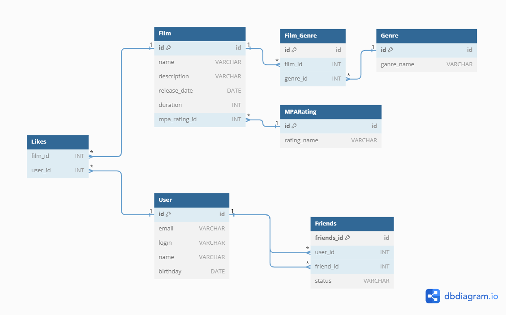

# java-filmorate
Template repository for Filmorate project.
 
Примеры запросов :

1) **SELECT * FROM Film;**  

Получаем все записи из таблицы Film.

2) **SELECT Film.name,  
          Film.description, 
          Genre.name AS genre 
   FROM Film 
   JOIN Film_Genre ON Film.id = Film_Genre.film_id 
   JOIN Genre ON Film_Genre.genre_id = Genre.id**;

Получение всех фильмов с их жанрами

3) SELECT Genre.name,  
   COUNT(Film_Genre.film_id) AS film_count 
   FROM Genre  
   LEFT JOIN Film_Genre ON Genre.id = Film_Genre.genre_id  
   GROUP BY Genre.id;  

Получение всех жанров и количество фильмов в каждом жанре

